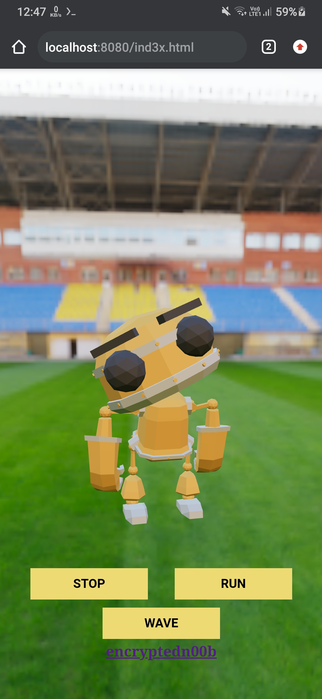

# ROBOO-X 3D Web augmented reality
* `WebAR refers to augmented reality experiences that are accessed through a web browser rather than an app. This means all you need is your smartphone or tablet and an internet connection, without having to download an app directly onto your phone.`
 
